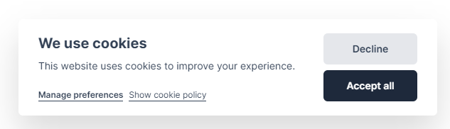
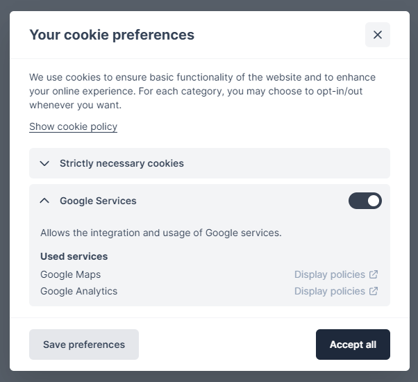

<div align="center">
    This library offers a simple way to handle GDPR compliant cookie consent concerns in your Blazor WASM/Serverside app.
</div>

<br />

<div align="center" style="padding-top: 3rem; padding-bottom: 5rem;">


</div>

<br />

## How to install

<details>
  <summary> 🔧 Installation .NET 8 and higher, Blazor United</summary>

<br>

```ps1
Install-Package BytexDigital.Blazor.Components.CookieConsent
```

<br />

### Requirements

- .NET >= 8.0
- You're using Blazor United (this is the case if your `<Router>` is inside your App.razor directly inside the `<body>` tag)

<br />

### Configure in your project

#### 1. Configure your App.razor

First you will have to determine which Blazor implementation should display the Cookie Consent user interface.
It can either be rendered with Blazor WebAssembly or Blazor Server.

##### 🅰️ If you choose to render it with Blazor WebAssembly, add the following beneath your router:

```html
<Router AppAssembly="@typeof(App).Assembly">
    ...
</Router>

<!-- Add this -->
<BytexDigital.Blazor.Components.CookieConsent.CookieConsentHandler @rendermode="@RenderMode.WebAssembly" />
<BytexDigital.Blazor.Components.CookieConsent.CookieConsentInitializer @rendermode="@RenderMode.Server" />
```

##### 🅱️ If you choose to render it with Blazor server, add the following instead:

```html
<Router AppAssembly="@typeof(App).Assembly">
    ...
</Router>

<!-- Add this -->
<BytexDigital.Blazor.Components.CookieConsent.CookieConsentHandler @rendermode="@RenderMode.Server" />
<BytexDigital.Blazor.Components.CookieConsent.CookieConsentInitializer @rendermode="@RenderMode.WebAssembly" />
```

<br />

#### 2. Add the required CSS

Add the following css include to your App.razor/Host.razor file.

```html
<link rel="stylesheet" href="_content/BytexDigital.Blazor.Components.CookieConsent/styles.min.css" />
```

<br />

#### 3. (Optional) Add the default font used

**Installing the font**  
By default, the components use the following order of fonts

```css
Inter var, ui-sans-serif, system-ui, -apple-system, BlinkMacSystemFont, "Segoe UI", Roboto, "Helvetica Neue", Arial, "Noto Sans", sans-serif, "Apple Color Emoji", "Segoe UI Emoji", "Segoe UI Symbol", "Noto Color Emoji"
```

`Inter` is the font used in the screenshots. If you wish the components to use this font, import the inter font by
additionally adding the following CSS link:

```html
<link rel="stylesheet" href="https://rsms.me/inter/inter.css" />
```

<br />

#### 4. Register and configure the services in your dependency container

Add the required services in your Program.cs/Startup.cs and configure cookie categories present in your application.

The library implicitly adds a `necessary` (value of constant `CookieCategory.NecessaryCategoryIdentifier`) category.

> ⚠️ When using Blazor United, the `AddCookieConsent` call must be made on both the server project AND the client project, regardless of where the user interface is rendered.
> This is to ensure that all components work as expected, regardless of whether you're using them in Blazor Server or Blazor WebAssembly.

<br>

##### 🅰️ If you're rendering the UI with Blazor WebAssembly, the call with have to be made as follows:

*In the WebAssembly client project*
```csharp
builder.Services.AddCookieConsent(o =>
{
    // Your configuration
});
```

*In the server project*
```csharp
builder.Services.AddCookieConsent(o =>
{
    // The same configuration as on the client! Best to put this lambda in a shared project to reuse to reduce duplication.
}, withUserInterface: false);
```

<br>

##### 🅱️️ If you're rendering the UI with Blazor Server, the call with have to be made as follows:

*In the WebAssembly client project*
```csharp
builder.Services.AddCookieConsent(o =>
{
    // The same configuration as on the client! Best to put this lambda in a shared project to reuse to reduce duplication.
}, withUserInterface: false);
```

*In the server project*
```csharp
builder.Services.AddCookieConsent(o =>
{
    // Your configuration
});
```

<br>

##### Example configuration

```cs
builder.Services.AddCookieConsent(o =>
{
    o.Revision = 1;
    o.PolicyUrl = "/cookie-policy";

    o.Categories.Add(new CookieCategory
    {
        TitleText = new()
        {
            ["en"] = "Google Services",
            ["de"] = "Google Dienste"
        },
        DescriptionText = new()
        {
            ["en"] = "Allows the integration and usage of Google services.",
            ["de"] = "Erlaubt die Verwendung von Google Diensten."
        },
        Identifier = "google",
        IsPreselected = true,

        Services = new()
        {
            new CookieCategoryService
            {
                Identifier = "google-maps",
                PolicyUrl = "https://policies.google.com/privacy",
                TitleText = new()
                {
                    ["en"] = "Google Maps",
                    ["de"] = "Google Maps"
                },
                ShowPolicyText = new()
                {
                    ["en"] = "Display policies",
                    ["de"] = "Richtlinien anzeigen"
                }
            },
            new CookieCategoryService
            {
                Identifier = "google-analytics",
                PolicyUrl = "https://policies.google.com/privacy",
                TitleText = new()
                {
                    ["en"] = "Google Analytics",
                    ["de"] = "Google Analytics"
                },
                ShowPolicyText = new()
                {
                    ["en"] = "Display policies",
                    ["de"] = "Richtlinien anzeigen"
                }
            }
        }
    });
});
```

</details>

<details>
  <summary> 🔧 Installation .NET 8 and higher, Full WebAssembly or Server</summary>

<br>

```ps1
Install-Package BytexDigital.Blazor.Components.CookieConsent
```

<br />

### Requirements

- .NET >= 8.0
- You're fully using Blazor WebAssembly or Blazor Server (This means your `<Router>` is inside a component that is fulled rendered either with Blazor Server or Blazor WASM (That is the case if there is a  `[RenderModeWebAssembly]` or `[RenderModeServer]` attribute on the component containing the router or if the component containing the router is rendered with a `@rendermode="@RenderMode.WebAssembly"` or `@rendermode="@RenderMode.Server"` attribute))

<br />

### Configure in your project

#### 1. Configure your App.razor

Add the `CookieConsentHandler` your App.razor, beneath the `Router` component, like so:

```html
<Router AppAssembly="@typeof(App).Assembly">
    <Found Context="routeData">
        <RouteView RouteData="@routeData" DefaultLayout="@typeof(EmptyLayout)" />
        <FocusOnNavigate RouteData="@routeData" Selector="h1" />
    </Found>
    <NotFound>
        <PageTitle>Not found</PageTitle>
        <LayoutView Layout="@typeof(EmptyLayout)">
            <p role="alert">Sorry, there's nothing at this address.</p>
        </LayoutView>
    </NotFound>
</Router>

<BytexDigital.Blazor.Components.CookieConsent.CookieConsentHandler />
```

<br />

#### 2. Add the required CSS

Add the following css include to your App.razor/Host.razor file.

```html
<link rel="stylesheet" href="_content/BytexDigital.Blazor.Components.CookieConsent/styles.min.css" />
```

<br />

#### 3. (Optional) Add the default font used

**Installing the font**  
By default, the components use the following order of fonts

```css
Inter var, ui-sans-serif, system-ui, -apple-system, BlinkMacSystemFont, "Segoe UI", Roboto, "Helvetica Neue", Arial, "Noto Sans", sans-serif, "Apple Color Emoji", "Segoe UI Emoji", "Segoe UI Symbol", "Noto Color Emoji"
```

`Inter` is the font used in the screenshots. If you wish the components to use this font, import the inter font by
additionally adding the following CSS link:

```html
<link rel="stylesheet" href="https://rsms.me/inter/inter.css" />
```

<br />

#### 4. Register and configure the services in your dependency container

Add the required services in your Program.cs/Startup.cs and configure cookie categories present in your application. The
library implicitly adds a `necessary` (value of constant `CookieCategory.NecessaryCategoryIdentifier`) category. For
example:

```cs
builder.Services.AddCookieConsent(o =>
{
    o.Revision = 1;
    o.PolicyUrl = "/cookie-policy";

    o.Categories.Add(new CookieCategory
    {
        TitleText = new()
        {
            ["en"] = "Google Services",
            ["de"] = "Google Dienste"
        },
        DescriptionText = new()
        {
            ["en"] = "Allows the integration and usage of Google services.",
            ["de"] = "Erlaubt die Verwendung von Google Diensten."
        },
        Identifier = "google",
        IsPreselected = true,

        Services = new()
        {
            new CookieCategoryService
            {
                Identifier = "google-maps",
                PolicyUrl = "https://policies.google.com/privacy",
                TitleText = new()
                {
                    ["en"] = "Google Maps",
                    ["de"] = "Google Maps"
                },
                ShowPolicyText = new()
                {
                    ["en"] = "Display policies",
                    ["de"] = "Richtlinien anzeigen"
                }
            },
            new CookieCategoryService
            {
                Identifier = "google-analytics",
                PolicyUrl = "https://policies.google.com/privacy",
                TitleText = new()
                {
                    ["en"] = "Google Analytics",
                    ["de"] = "Google Analytics"
                },
                ShowPolicyText = new()
                {
                    ["en"] = "Display policies",
                    ["de"] = "Richtlinien anzeigen"
                }
            }
        }
    });
});
```

#### 5. The library is ready to be used!

Scroll further down to see how you can use the library to conditionally enable/disable Javascript tags in your HTML or
show/hide specific content.

</details>

<details>
  <summary> 🔧 Installation .NET 7 and prior</summary>

<br>

```ps1
Install-Package BytexDigital.Blazor.Components.CookieConsent
```

<br />

### Requirements

.NET >= 5.0 and < 8.0

<br />

### Configure in your project

#### 1. Configure your App.razor

Add the `CookieConsentHandler` your App.razor, beneath the `Router` component, like so:

```html
<Router AppAssembly="@typeof(App).Assembly">
    <Found Context="routeData">
        <RouteView RouteData="@routeData" DefaultLayout="@typeof(EmptyLayout)" />
        <FocusOnNavigate RouteData="@routeData" Selector="h1" />
    </Found>
    <NotFound>
        <PageTitle>Not found</PageTitle>
        <LayoutView Layout="@typeof(EmptyLayout)">
            <p role="alert">Sorry, there's nothing at this address.</p>
        </LayoutView>
    </NotFound>
</Router>

<BytexDigital.Blazor.Components.CookieConsent.CookieConsentHandler />
```

<br />

#### 2. Add the required CSS

Add the following css include to your index.html/_Host.cshtml file.

```html
<link rel="stylesheet" href="_content/BytexDigital.Blazor.Components.CookieConsent/styles.min.css" />
```

<br />

#### 3. (Optional) Add the default font used

**Installing the font**  
By default, the components use the following order of fonts

```css
Inter var, ui-sans-serif, system-ui, -apple-system, BlinkMacSystemFont, "Segoe UI", Roboto, "Helvetica Neue", Arial, "Noto Sans", sans-serif, "Apple Color Emoji", "Segoe UI Emoji", "Segoe UI Symbol", "Noto Color Emoji"
```

`Inter` is the font used in the screenshots. If you wish the components to use this font, import the inter font by
additionally adding the following CSS link:

```html
<link rel="stylesheet" href="https://rsms.me/inter/inter.css" />
```

<br />

#### 4. Register and configure the services in your dependency container

Add the required services in your Program.cs/Startup.cs and configure cookie categories present in your application. The
library implicitly adds a `necessary` (value of constant `CookieCategory.NecessaryCategoryIdentifier`) category. For
example:

```cs
builder.Services.AddCookieConsent(o =>
{
    o.Revision = 1;
    o.PolicyUrl = "/cookie-policy";
    
    // Call optional
    o.UseDefaultConsentPrompt(prompt =>
    {
        prompt.Position = ConsentModalPosition.BottomRight;
        prompt.Layout = ConsentModalLayout.Bar;
        prompt.SecondaryActionOpensSettings = false;
        prompt.AcceptAllButtonDisplaysFirst = false;
    });

    o.Categories.Add(new CookieCategory
    {
        TitleText = new()
        {
            ["en"] = "Google Services",
            ["de"] = "Google Dienste"
        },
        DescriptionText = new()
        {
            ["en"] = "Allows the integration and usage of Google services.",
            ["de"] = "Erlaubt die Verwendung von Google Diensten."
        },
        Identifier = "google",
        IsPreselected = true,

        Services = new()
        {
            new CookieCategoryService
            {
                Identifier = "google-maps",
                PolicyUrl = "https://policies.google.com/privacy",
                TitleText = new()
                {
                    ["en"] = "Google Maps",
                    ["de"] = "Google Maps"
                },
                ShowPolicyText = new()
                {
                    ["en"] = "Display policies",
                    ["de"] = "Richtlinien anzeigen"
                }
            },
            new CookieCategoryService
            {
                Identifier = "google-analytics",
                PolicyUrl = "https://policies.google.com/privacy",
                TitleText = new()
                {
                    ["en"] = "Google Analytics",
                    ["de"] = "Google Analytics"
                },
                ShowPolicyText = new()
                {
                    ["en"] = "Display policies",
                    ["de"] = "Richtlinien anzeigen"
                }
            }
        }
    });
});
```

#### 5. The library is ready to be used!

Scroll further down to see how you can use the library to conditionally enable/disable Javascript tags in your HTML or
show/hide specific content.

</details>


<br />

## Localization

For now, localization is done entirely inside the configuration of the services as seen in the example above. The
library ships with default texts in English, German Dutch, French and Spanish.

The library uses the current `CurrentCulture` by default. Blazor's `.AddLocalization(..)` will automatically set the
current culture. We aim at adding proper support for `IStringLocalizer` aswell, so that all localization can be done
inside resource files instead.

## Disabled or blocked JavaScript

The library depends on JavaScript to save and load preferences and to enable HTML script tags. If JavaScript is blocked
or not enabled by a browser, the library will **not be able to dynamically enable JavaScript tags
like `<script type="text/plain" data-consent-category="myCategoryName">`**; They will remain disabled even if given
permission by the user. **Saving and loading preferences will also not be possible**, which means any permissions the
user has given will be forgotten if the browser tab is closed and are only valid within the browser tab they were given
in.

## Customizing colors and font

Use a CSS rule as follows to overwrite colors and font used.
The values shown are the current default values as shown in the screenshots using Tailwind's theme function.

```css
.cc-isolation-container * {
    /* Font used */
    --cc-font-family: Inter var, ui-sans-serif, system-ui, -apple-system, BlinkMacSystemFont, "Segoe UI", Roboto, "Helvetica Neue", Arial, "Noto Sans", sans-serif, "Apple Color Emoji", "Segoe UI Emoji", "Segoe UI Symbol", "Noto Color Emoji";

    /* Accent color for primary button */
    --cc-color-accent: theme(colors.slate.800);

    /* Accent color for primary button when hovered */
    --cc-color-accent-dark: theme(colors.slate.900);

    /* Color for secondary button */
    --cc-color-secondary: theme(colors.gray.200);

    /* Color for secondary button when hovered */
    --cc-color-secondary-dark: theme(colors.gray.300);

    /* Color for links ("Display policy" links within preferences dialogue) */
    --cc-color-link: theme(colors.slate.400);
    
    /* Color for link when hovered */
    --cc-color-link-highlight: theme(colors.blue.500);

    /* Default color for text */
    --cc-color-text: theme(colors.slate.700);

    /* Background color for active category switch */
    --cc-color-switch-active: theme(colors.slate.800);

    /* (Transparent) Color for background when any modal is opened */
    --cc-color-modal-background: theme(colors.gray.800 / 75%);
}
```

<br />

## Available ways to hide/show content based on cookie preferences

### JavaScript tags

If you wish to use services like Google Analytics, you can integrate them with this library the following way. This will
make it so the script tags do not get run unless allowed to do so by the user.

1. Change the script tags type attribute from `type="text/javascript"` to `type"text/plain"`.
2. Add the attribute `data-consent-category="IDENTIFIER"`.
3. Replace `IDENTIFIER` with the Identifier given to a configured category. In the example given earlier, this could
   be `google`.

> ***Blazor Server* Important note:**
> It appears as though when using Blazor Server, Javascript-tags require the `defer="true"` attribute to be set so that
> the script tag is not removed by Blazor upon
> load ([view issue](https://github.com/BytexDigital/BytexDigital.Blazor.Components.CookieConsent/issues/9#issue-1269307707)).

The result should look like so:

```html
<script type="text/plain" data-consent-category="google">
    (function(i,s,o,g,r,a,m){i['GoogleAnalyticsObject']=r;i[r]=i[r]||function(){
    (i[r].q=i[r].q||[]).push(arguments)},i[r].l=1*new Date();a=s.createElement(o),
    m=s.getElementsByTagName(o)[0];a.async=1;a.src=g;m.parentNode.insertBefore(a,m)
    })(window,document,'script','https://www.google-analytics.com/analytics.js','ga');

    ga('create', 'UA-XXXXX-Y', 'auto');
    ga('send', 'pageview');
</script>
```

This Google Analytics script will only load if given permission.

<br />

### `CookieConsentCheck` component

You can use the prebuilt component to show content only if given permission in a category. This can be useful for
displaying iframes, for example Google Maps or YouTube videos:

```html
<CookieConsentCheck RequiredCategory="google">
    <Allowed>
        <iframe loading="lazy" allowfullscreen src="https://www.google.com/maps/embed/v1/place?q=place_id:ChIJAVkDPzdOqEcRcDteW0YgIQQ&key=..."></iframe>
    </Allowed>
</CookieConsentCheck>
```

You can customize what this component will render when the given `RequiredCategory` is not allowed by defining
a `NotAllowed` tag. By default, the component will render this:

<br />

<div align="center">

</div>

<br />

Defining something custom to render can be done the following way. It's a good idea to set the `Context` parameter on
the `CookieConsentCheck` component so you can easily access it's properties inside your custom `NotAllowed` block (for
example the `Component.Category` property to access the display name of the required category).

```html
<CookieConsentCheck RequiredCategory="google" Context="Component">
    <Allowed>
        <h1>It works!</h1>
    </Allowed>
    <NotAllowed>
        <button @onclick="async () => await Component.AcceptRequiredAsync()">Show it!</button>
    </NotAllowed>
</CookieConsentCheck>
```

<br/>

## Manually open the preferences modal

Call the following
metho[BytexDigital.Blazor.Components.CookieConsent.csproj](BytexDigital.Blazor.Components.CookieConsent%2FBytexDigital.Blazor.Components.CookieConsent.csproj)
d to show the preferences menu. This could be done from an element inside your footer for example.

```csharp
CookieConsentService.ShowSettingsModalAsync();
```

## Stop scripts (like Google Analytics) from running if consent is revoked

If you integrate services such as Google Analytics and the user grants consent, scripts might start running in the background. To stop these scripts from executing once the user revokes consent, it is necessary to refresh the page~~~~.

To achieve this, you can subscribe to the following event and evaluate whether a specific category consent has been
revoked that requires action such as refreshing the page to stop aforementioned scripts:

```csharp
CookieConsentService.CategoryConsentChanged += (sender, args) =>
{
    if (args.CategoryIdentifier == "google" &&
        args.ChangedTo == ConsentChangedArgs.ConsentChangeType.Revoked &&
        !args.IsInitialChange)
    {
        // Reload the current page with a hard refresh (restart Blazor app).~~~~
        NavigationManager.NavigateTo(NavigationManager.Uri, forceLoad: true);
    }
};
```

# Changelog

### 1.0.17

<details>
  <summary>Click to expand!</summary>

   <br /> 

- Implemented way to use custom consent prompts components instead of the default one
- Improved default consent prompt behavior on mobile devices
- Overall css improvements

</details>

### 1.0.16

<details>
  <summary>Click to expand!</summary>

   <br /> 

- Implemented way to customize some colors aswell as the font using CSS variables

</details>

### 1.0.15

<details>
  <summary>Click to expand!</summary>

   <br /> 

- Fixed crashes related to JavaScript being not enabled or blocked by browsers (
  see https://github.com/BytexDigital/BytexDigital.Blazor.Components.CookieConsent/issues/12)

</details>

### 1.0.13

<details>
  <summary>Click to expand!</summary>

   <br /> 

- (https://github.com/BytexDigital/BytexDigital.Blazor.Components.CookieConsent/pull/11) Added languages ES, FR

</details>

### 1.0.12

<details>
  <summary>Click to expand!</summary>

   <br /> 

- (https://github.com/BytexDigital/BytexDigital.Blazor.Components.CookieConsent/pull/10) Added language NL

</details>

### 1.0.11

<details>
  <summary>Click to expand!</summary>

   <br /> 

- Fixed conditional script tags not being executed after activation in Firefox (
  see https://github.com/BytexDigital/BytexDigital.Blazor.Components.CookieConsent/issues/9)

</details>

### 1.0.10

<details>
  <summary>Click to expand!</summary>

   <br /> 

- (https://github.com/BytexDigital/BytexDigital.Blazor.Components.CookieConsent/issues/8) Fixed preferences being saved
  with revision set to -1

</details>

### 1.0.9

<details>
  <summary>Click to expand!</summary>

   <br /> 

- Implemented CSS reset to isolate the components of this library from any other CSS influence

</details>

### 1.0.6

<details>
  <summary>Click to expand!</summary>

   <br /> 

- Improved support for overwriting of font used

</details>

